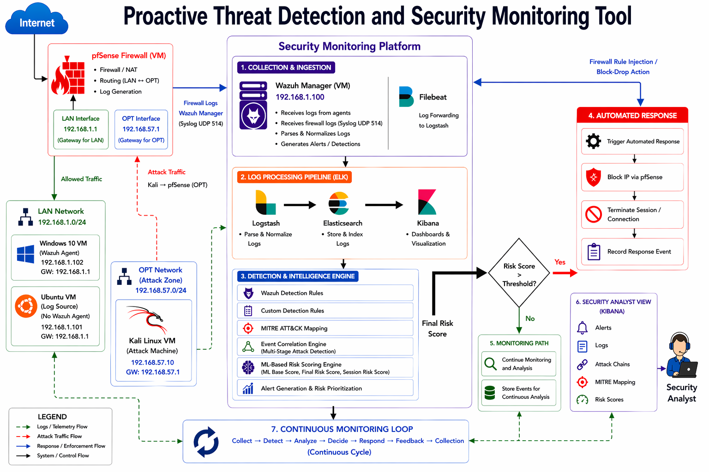

# AutoResponse-SIEM
An integrated, real-time security monitoring system designed to detect, analyze, and automatically mitigate multi-stage cyber threats using an open-source security stack and machine learning risk scoring.

## Overview
The Proactive Threat Detection and Security Monitoring Tool is an integrated SOC framework designed to detect, analyze, and automatically respond to multi-stage cyberattacks in real-time. It addresses the operational challenges of traditional SIEMs such as isolated event analysis and manual response delays by introducing hybrid detection that correlates related security events into a continuous, observable attack chain.
## System Architecture

## Project Goals
The project was developed with the following core objectives:

* **Centralized Monitoring:** Designing a system to collect and analyze security data from multiple sources (Windows and Sysmon telemetry).
* **Dynamic Risk Scoring:** Integrating detection rules and machine learning to prioritize high-risk events, reducing alert fatigue.
* **Attack Correlation:** Linking multi-stage attack events into a single sequence (attack chain) to track threat progression.
* **Automated Response:** Implementing immediate mitigation, such as IP blocking and session termination via firewall integration.
* **Real-Time Visualization:** Developing dashboards to monitor attack progressions, risk scores, and response status.
